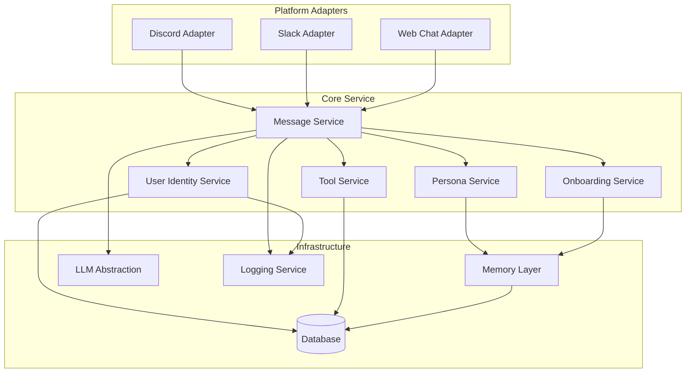

# Design Document: BotBot v2 Consumer Release

## Overview

BotBot v2 transforms from a Discord-first prototype into a platform-agnostic personal companion. The architecture separates the core intelligence from platform-specific adapters, enabling BotBot to maintain a unified identity, persistent memory, and consistent personality across Discord, Slack, and web chat interfaces.

The system follows a layered architecture where platform adapters normalize incoming events into a common message format, the core service processes messages using LLM providers and memory, and responses are transformed back into platform-specific formats for delivery.

## Architecture



### Message Flow

1. Platform adapter receives event from external service
2. Adapter normalizes event into `CoreMessage` format
3. Core Service validates and processes message
4. User Identity Service resolves/creates user record
5. Memory Layer retrieves relevant context
6. Persona Service injects active persona template
7. LLM Abstraction generates response
8. Tool Service executes any detected tool invocations
9. Response is returned to adapter
10. Adapter transforms response to platform format and delivers

## Components and Interfaces

### Core Message Interface

```typescript
interface CoreMessage {
  id: string;
  userId: string;           // Unified user ID
  platformId: string;       // 'discord' | 'slack' | 'web'
  platformUserId: string;   // Platform-specific user ID
  channelId: string;        // Platform-specific channel/conversation ID
  content: string;          // Message text
  timestamp: Date;
  metadata?: Record<string, unknown>;
}

interface CoreResponse {
  text: string;
  richContent?: RichContent;
  events: InternalEvent[];
  metadata?: Record<string, unknown>;
}

interface RichContent {
  type: 'embed' | 'card' | 'buttons';
  title?: string;
  description?: string;
  fields?: Array<{ name: string; value: string }>;
  actions?: Array<{ id: string; label: string; style?: string }>;
}

interface InternalEvent {
  type: 'memory_stored' | 'tool_invoked' | 'persona_switched' | 'user_created';
  payload: Record<string, unknown>;
}
```

### Platform Adapter Interface

```typescript
interface PlatformAdapter {
  platformId: string;
  
  // Lifecycle
  initialize(): Promise<void>;
  shutdown(): Promise<void>;
  
  // Message handling
  normalizeEvent(event: unknown): CoreMessage;
  formatResponse(response: CoreResponse): unknown;
  sendMessage(channelId: string, response: unknown): Promise<void>;
  
  // Connection management
  onConnectionLost(callback: () => void): void;
  reconnect(): Promise<void>;
}
```

### Core Service Interface

```typescript
interface CoreService {
  processMessage(message: CoreMessage): Promise<CoreResponse>;
  registerAdapter(adapter: PlatformAdapter): void;
  getRegisteredAdapters(): string[];
}
```

### User Identity Interface

```typescript
interface User {
  id: string;                    // Unified user ID (UUID)
  createdAt: Date;
  onboarded: boolean;
  preferredName?: string;
  platformLinks: PlatformLink[];
}

interface PlatformLink {
  platformId: string;
  platformUserId: string;
  linkedAt: Date;
}

interface UserIdentityService {
  resolveUser(platformId: string, platformUserId: string): Promise<User>;
  createUser(platformId: string, platformUserId: string): Promise<User>;
  linkPlatform(userId: string, platformId: string, platformUserId: string): Promise<void>;
  generateLinkCode(userId: string): Promise<string>;
  validateLinkCode(code: string, platformId: string, platformUserId: string): Promise<boolean>;
}
```

### Memory Layer Interface

```typescript
interface Memory {
  id: string;
  userId: string;
  content: string;
  tags: string[];
  timestamp: Date;
  source: 'conversation' | 'onboarding' | 'explicit';
}

interface MemoryLayer {
  store(userId: string, content: string, tags: string[]): Promise<Memory>;
  retrieve(userId: string, context: string, limit?: number): Promise<Memory[]>;
  exportAll(userId: string): Promise<Memory[]>;
  clearAll(userId: string): Promise<void>;
}
```

### LLM Abstraction Interface

```typescript
interface LLMProvider {
  providerId: string;
  
  complete(request: CompletionRequest): Promise<CompletionResponse>;
}

interface CompletionRequest {
  messages: Array<{ role: 'system' | 'user' | 'assistant'; content: string }>;
  temperature?: number;
  maxTokens?: number;
}

interface CompletionResponse {
  content: string;
  usage: { promptTokens: number; completionTokens: number };
  finishReason: 'stop' | 'length' | 'tool_call';
}

interface LLMAbstraction {
  getProvider(): LLMProvider;
  complete(request: CompletionRequest): Promise<CompletionResponse>;
}
```

### Persona Interface

```typescript
interface Persona {
  id: string;
  name: string;
  systemPrompt: string;
  greeting?: string;
  traits: string[];
}

interface PersonaService {
  getActive(userId: string): Promise<Persona>;
  setActive(userId: string, personaId: string): Promise<void>;
  getDefault(): Persona;
  injectPersona(persona: Persona, messages: CompletionRequest['messages']): CompletionRequest['messages'];
}
```

### Tool Interface

```typescript
interface Tool {
  id: string;
  name: string;
  description: string;
  parameters: ToolParameter[];
  
  execute(params: Record<string, unknown>, context: ToolContext): Promise<ToolResult>;
}

interface ToolParameter {
  name: string;
  type: 'string' | 'number' | 'boolean' | 'date';
  required: boolean;
  description: string;
}

interface ToolContext {
  userId: string;
  platformId: string;
  channelId: string;
}

interface ToolResult {
  success: boolean;
  message: string;
  data?: Record<string, unknown>;
}

interface ToolService {
  registerTool(tool: Tool): void;
  detectInvocation(content: string): { toolId: string; params: Record<string, unknown> } | null;
  execute(toolId: string, params: Record<string, unknown>, context: ToolContext): Promise<ToolResult>;
}
```

## Data Models

### Database Schema

```sql
-- Unified users
CREATE TABLE users (
  id TEXT PRIMARY KEY,
  created_at TIMESTAMP DEFAULT CURRENT_TIMESTAMP,
  onboarded BOOLEAN DEFAULT FALSE,
  preferred_name TEXT,
  active_persona_id TEXT
);

-- Platform identity links
CREATE TABLE platform_links (
  id TEXT PRIMARY KEY,
  user_id TEXT NOT NULL REFERENCES users(id),
  platform_id TEXT NOT NULL,
  platform_user_id TEXT NOT NULL,
  linked_at TIMESTAMP DEFAULT CURRENT_TIMESTAMP,
  UNIQUE(platform_id, platform_user_id)
);

-- Memory storage
CREATE TABLE memories (
  id TEXT PRIMARY KEY,
  user_id TEXT NOT NULL REFERENCES users(id),
  content TEXT NOT NULL,
  tags TEXT NOT NULL, -- JSON array
  timestamp TIMESTAMP DEFAULT CURRENT_TIMESTAMP,
  source TEXT NOT NULL
);

-- Reminders (tool data)
CREATE TABLE reminders (
  id TEXT PRIMARY KEY,
  user_id TEXT NOT NULL REFERENCES users(id),
  platform_id TEXT NOT NULL,
  channel_id TEXT NOT NULL,
  message TEXT NOT NULL,
  due_at TIMESTAMP NOT NULL,
  delivered BOOLEAN DEFAULT FALSE,
  created_at TIMESTAMP DEFAULT CURRENT_TIMESTAMP
);

-- Link verification codes
CREATE TABLE link_codes (
  code TEXT PRIMARY KEY,
  user_id TEXT NOT NULL REFERENCES users(id),
  created_at TIMESTAMP DEFAULT CURRENT_TIMESTAMP,
  expires_at TIMESTAMP NOT NULL,
  used BOOLEAN DEFAULT FALSE
);
```

### Persona Configuration (JSON)

```json
{
  "id": "default-botbot",
  "name": "BotBot",
  "systemPrompt": "You are BotBot, a friendly and helpful personal companion...",
  "greeting": "Hey there! I'm BotBot, your personal companion.",
  "traits": ["friendly", "helpful", "remembers details", "casual tone"]
}
```

## Correctness Properties

*A property is a characteristic or behavior that should hold true across all valid executions of a system-essentially, a formal statement about what the system should do. Properties serve as the bridge between human-readable specifications and machine-verifiable correctness guarantees.*

### Property 1: Core Message Round-Trip Consistency
*For any* valid CoreMessage object, serializing to JSON and then parsing back SHALL produce an equivalent object with all fields preserved.
**Validates: Requirements 1.4, 1.5**

### Property 2: Invalid Message Rejection
*For any* message object that violates the CoreMessage schema, the Core Service SHALL return a structured error response containing an error code and description.
**Validates: Requirements 1.2, 1.3**

### Property 3: Platform Event Normalization Completeness
*For any* valid platform event (Discord, Slack, or Web), the normalized CoreMessage SHALL contain non-empty userId, platformId, platformUserId, channelId, content, and timestamp fields.
**Validates: Requirements 2.1, 3.1, 4.1, 5.1**

### Property 4: Response Transformation Validity
*For any* CoreResponse with rich content, the platform-specific transformation SHALL produce valid output for that platform (Discord embed, Slack Block Kit, or HTML).
**Validates: Requirements 2.2, 3.2, 4.2, 5.2**

### Property 5: Exponential Backoff Timing
*For any* sequence of connection failures, the retry delays SHALL follow exponential backoff pattern where delay(n) >= delay(n-1) * backoffMultiplier, up to maxRetries.
**Validates: Requirements 2.3**

### Property 6: User Identity Resolution Consistency
*For any* known platform-user combination, resolving the user SHALL always return the same unified user ID.
**Validates: Requirements 6.1**

### Property 7: User Identity Storage Round-Trip
*For any* newly created user with platform links, storing and then retrieving the user SHALL return the complete record including all linked platform identities.
**Validates: Requirements 6.2, 6.4, 6.5**

### Property 8: Memory Storage Completeness
*For any* stored memory, the record SHALL contain the original content, user ID, timestamp, and all provided tags.
**Validates: Requirements 7.1**

### Property 9: Memory Round-Trip Consistency
*For any* valid Memory object, serializing to JSON and then parsing back SHALL produce an equivalent object.
**Validates: Requirements 7.5, 7.6**

### Property 10: Memory Export Completeness
*For any* user with stored memories, exporting all memories SHALL return every memory previously stored for that user.
**Validates: Requirements 7.3**

### Property 11: Memory Clear Effectiveness
*For any* user, after clearing all memories, retrieving memories SHALL return an empty result set.
**Validates: Requirements 7.4**

### Property 12: LLM Response Normalization
*For any* completion request, the LLM Abstraction SHALL return a response with non-empty content, valid usage statistics, and a recognized finish reason.
**Validates: Requirements 8.2**

### Property 13: LLM Error Wrapping
*For any* LLM provider error, the abstraction layer SHALL return a standardized error response containing the original error message and provider identifier.
**Validates: Requirements 8.3**

### Property 14: LLM Request Round-Trip Consistency
*For any* valid CompletionRequest, serializing to JSON and then parsing back SHALL produce an equivalent object.
**Validates: Requirements 8.5, 8.6**

### Property 15: Persona Injection Preservation
*For any* persona and message array, injecting the persona SHALL prepend the system prompt while preserving all original messages in order.
**Validates: Requirements 9.2**

### Property 16: Persona Switch Memory Preservation
*For any* user with existing memories, switching personas SHALL not modify, delete, or affect any stored memories.
**Validates: Requirements 9.4**

### Property 17: Persona Round-Trip Consistency
*For any* valid Persona configuration, serializing to JSON and then parsing back SHALL produce an equivalent object.
**Validates: Requirements 9.5, 9.6**

### Property 18: Onboarding Trigger for New Users
*For any* first message from a user not marked as onboarded, the system SHALL trigger the onboarding flow.
**Validates: Requirements 10.1**

### Property 19: Onboarding Preference Storage
*For any* user preferences provided during onboarding, the preferences SHALL be stored in the Memory Layer and retrievable.
**Validates: Requirements 10.4**

### Property 20: Onboarding Completion State
*For any* user who completes onboarding, the user record SHALL be marked as onboarded=true.
**Validates: Requirements 10.5**

### Property 21: Returning User Name Retrieval
*For any* returning user with a stored preferred name, the Recognition System SHALL retrieve and include that name.
**Validates: Requirements 11.1**

### Property 22: Returning User Memory Inclusion
*For any* returning user with stored memories, the greeting SHALL reference at least one relevant past detail.
**Validates: Requirements 11.2**

### Property 23: Tool Execution Correctness
*For any* detected tool invocation with valid parameters, the Tool System SHALL execute the correct tool and return a result.
**Validates: Requirements 12.1**

### Property 24: Reminder Creation Completeness
*For any* reminder tool invocation, the created reminder record SHALL contain the specified time, message, user ID, and platform context.
**Validates: Requirements 12.2**

### Property 25: Tool Error User-Friendliness
*For any* tool execution failure, the returned error message SHALL be non-technical and explain what went wrong.
**Validates: Requirements 12.4**

### Property 26: Tool Invocation Round-Trip Consistency
*For any* valid tool invocation record, serializing to JSON and then parsing back SHALL produce an equivalent object.
**Validates: Requirements 12.5, 12.6**

### Property 27: Configuration Environment Loading
*For any* application startup, all configuration values SHALL be loaded from environment variables with no hardcoded secrets in source code.
**Validates: Requirements 13.5**

### Property 28: Log Entry Structure
*For any* logged message event (received or sent), the log entry SHALL contain user identifier, platform identifier, timestamp, and SHALL NOT contain secrets or sensitive data.
**Validates: Requirements 14.1, 14.2**

### Property 29: Log Entry JSON Validity
*For any* log entry, the serialized output SHALL be valid JSON parseable by standard JSON parsers.
**Validates: Requirements 14.5**

### Property 30: Error Handler Graceful Fallback
*For any* LLM provider error, the Error Handler SHALL return a user-facing response that does not expose internal error details.
**Validates: Requirements 14.3**

### Property 31: Web Session Uniqueness
*For any* two web chat sessions created, the generated session identifiers SHALL be different.
**Validates: Requirements 5.3**

## Error Handling

### Error Categories

| Category | HTTP Status | User Message | Logging Level |
|----------|-------------|--------------|---------------|
| Validation Error | 400 | "I didn't understand that. Could you rephrase?" | WARN |
| Authentication Error | 401 | "I'm having trouble verifying your identity." | ERROR |
| Rate Limit | 429 | "I need a moment to catch up. Try again shortly." | WARN |
| LLM Provider Error | 503 | "I'm having trouble thinking right now. Let me try again." | ERROR |
| Internal Error | 500 | "Something went wrong on my end. Please try again." | ERROR |

### Retry Strategy

```typescript
const retryConfig = {
  maxRetries: 3,
  initialDelayMs: 1000,
  maxDelayMs: 30000,
  backoffMultiplier: 2,
  retryableErrors: ['RATE_LIMIT', 'TIMEOUT', 'SERVICE_UNAVAILABLE']
};
```

### Graceful Degradation

1. **LLM Unavailable**: Return cached response or friendly "try again" message
2. **Memory Layer Unavailable**: Continue without personalization, log warning
3. **Platform Connection Lost**: Queue messages, attempt reconnection with backoff
4. **Tool Execution Failed**: Return user-friendly error, continue conversation

## Testing Strategy

### Property-Based Testing Library

**fast-check** will be used for property-based testing in TypeScript/JavaScript.

### Test Configuration

- Minimum 100 iterations per property test
- Seed logging for reproducibility
- Shrinking enabled for minimal failing examples

### Unit Tests

Unit tests will cover:
- Message schema validation edge cases
- Platform adapter field extraction
- User identity resolution logic
- Memory storage and retrieval
- Persona template injection
- Tool parameter parsing
- Error message formatting

### Property-Based Tests

Each correctness property will be implemented as a single property-based test with:
- Comment referencing the property: `// **Feature: botbot-v2-consumer-release, Property N: Property Name**`
- Arbitrary generators for input types
- Assertions matching the property specification

### Integration Tests

Integration tests will cover:
- End-to-end message flow (mocked LLM)
- Cross-platform user identity linking
- Onboarding flow completion
- Reminder creation and delivery
- Persona switching with memory preservation

### Test Organization

```
tests/
├── unit/
│   ├── core/
│   │   ├── messageValidation.test.ts
│   │   └── responseFormatting.test.ts
│   ├── adapters/
│   │   ├── discord.test.ts
│   │   ├── slack.test.ts
│   │   └── web.test.ts
│   ├── identity/
│   │   └── userIdentity.test.ts
│   ├── memory/
│   │   └── memoryLayer.test.ts
│   ├── llm/
│   │   └── llmAbstraction.test.ts
│   ├── persona/
│   │   └── personaService.test.ts
│   └── tools/
│       └── toolService.test.ts
├── property/
│   ├── core.property.test.ts
│   ├── adapters.property.test.ts
│   ├── identity.property.test.ts
│   ├── memory.property.test.ts
│   ├── llm.property.test.ts
│   ├── persona.property.test.ts
│   ├── tools.property.test.ts
│   └── logging.property.test.ts
└── integration/
    ├── messageFlow.test.ts
    ├── onboarding.test.ts
    └── crossPlatform.test.ts
```
