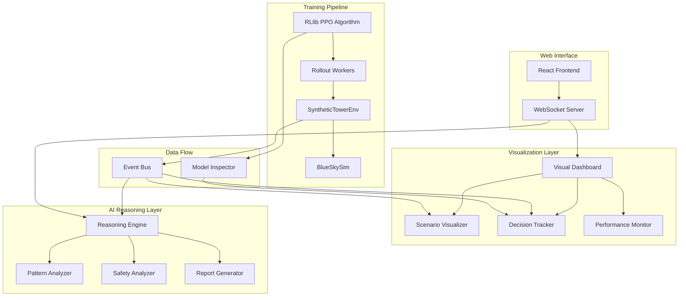

# Design Document

## Overview

This design enhances the Synthetic Tower AI ATC Controller Training Environment with comprehensive visualization capabilities and automated AI reasoning systems. The solution integrates real-time visualization, decision tracking, automated performance analysis, and an interactive dashboard to showcase the system's capabilities while providing deep insights into AI controller behavior.

The design leverages the existing RLlib PPO training architecture and extends it with visualization and reasoning components that operate alongside the training process without disrupting the core RL pipeline.

## Architecture

### High-Level System Architecture



### Component Integration with Existing System

The visualization and reasoning components integrate with the existing architecture through:

1. **Event Bus**: Captures training events, environment states, and AI decisions
2. **Model Inspector**: Extracts policy network activations and decision rationales
3. **WebSocket Server**: Provides real-time data streaming to the web interface
4. **Background Services**: Run analysis and monitoring without blocking training

## Components and Interfaces

### 1. Event Bus System

**Purpose**: Central hub for capturing and distributing training events and state information.

**Interface**:
```python
class EventBus:
    def publish(self, event_type: str, data: Dict[str, Any]) -> None
    def subscribe(self, event_type: str, callback: Callable) -> str
    def unsubscribe(self, subscription_id: str) -> None
```

**Event Types**:
- `env.reset`: Environment reset with initial states
- `env.step`: Environment step with observations, actions, rewards
- `policy.decision`: Policy network decision with confidence scores
- `safety.violation`: Loss of separation or near-miss events
- `training.iteration`: Training iteration completion with metrics

### 2. Scenario Visualizer

**Purpose**: Real-time graphical rendering of air traffic scenarios and AI controller actions.

**Interface**:
```python
class ScenarioVisualizer:
    def __init__(self, canvas_size: Tuple[int, int])
    def update_aircraft_states(self, states: List[Dict]) -> None
    def highlight_conflicts(self, conflicts: List[Tuple[str, str]]) -> None
    def render_frame(self) -> np.ndarray
    def get_canvas_data(self) -> Dict[str, Any]
```

**Features**:
- Aircraft position tracking with trail history
- Separation distance visualization with color-coded zones
- Conflict highlighting and warning indicators
- Sector boundary and navigation aid rendering
- Real-time updates at 10+ FPS during training

### 3. Decision Tracker

**Purpose**: Capture and analyze AI controller decision-making processes.

**Interface**:
```python
class DecisionTracker:
    def log_decision(self, observation: np.ndarray, action: np.ndarray, 
                    policy_output: Dict[str, Any]) -> None
    def get_decision_history(self, limit: int = 100) -> List[Dict]
    def analyze_decision_patterns(self) -> Dict[str, Any]
    def explain_action(self, action_idx: int) -> str
```

**Tracked Information**:
- Input observations and their interpretations
- Policy network activations and attention weights
- Action probabilities and confidence scores
- Predicted outcomes and value estimates
- Decision rationale using gradient-based explanations

### 4. Reasoning Engine

**Purpose**: Automated analysis of AI controller performance and behavior patterns.

**Interface**:
```python
class ReasoningEngine:
    def analyze_episode(self, episode_data: Dict[str, Any]) -> AnalysisReport
    def detect_patterns(self, episodes: List[Dict]) -> List[Pattern]
    def generate_recommendations(self, analysis: AnalysisReport) -> List[str]
    def assess_safety_metrics(self, episode_data: Dict) -> SafetyReport
```

**Analysis Capabilities**:
- Safety violation root cause analysis
- Performance trend identification
- Behavioral pattern recognition
- Training parameter optimization suggestions
- Comparative analysis across training runs

### 5. Performance Monitor

**Purpose**: Continuous tracking and reporting of system health and training progress.

**Interface**:
```python
class PerformanceMonitor:
    def track_metrics(self, metrics: Dict[str, float]) -> None
    def generate_daily_report(self) -> Report
    def check_anomalies(self) -> List[Anomaly]
    def get_trend_analysis(self, metric: str, days: int) -> TrendData
```

**Monitored Metrics**:
- Episode rewards and convergence rates
- Safety violation frequencies
- Training stability indicators
- Resource utilization patterns
- Model performance degradation alerts

### 6. Visual Dashboard

**Purpose**: Interactive web interface for showcasing system capabilities and controlling training.

**Interface**:
```python
class VisualDashboard:
    def start_server(self, port: int = 8080) -> None
    def broadcast_update(self, data: Dict[str, Any]) -> None
    def handle_user_command(self, command: Dict[str, Any]) -> Dict[str, Any]
```

**Dashboard Features**:
- Live training visualization with smooth animations
- Interactive scenario selection and configuration
- Real-time performance metrics and charts
- Decision explanation panels
- Training control interface (start/pause/configure)

## Data Models

### Aircraft State Model
```python
@dataclass
class AircraftState:
    id: str
    position: Tuple[float, float]  # x_nm, y_nm
    velocity: float  # v_kt
    heading: float  # hdg_rad
    altitude: float  # alt_ft
    goal_position: Tuple[float, float]  # goal_x_nm, goal_y_nm
    alive: bool
    intent: str
    trail_history: List[Tuple[float, float]]
```

### Decision Record Model
```python
@dataclass
class DecisionRecord:
    timestamp: float
    observation: np.ndarray
    action: np.ndarray
    policy_logits: np.ndarray
    value_estimate: float
    confidence_scores: Dict[str, float]
    explanation: str
    predicted_outcomes: Dict[str, float]
```

### Analysis Report Model
```python
@dataclass
class AnalysisReport:
    episode_id: str
    safety_score: float
    efficiency_score: float
    violations: List[SafetyViolation]
    patterns: List[BehaviorPattern]
    recommendations: List[str]
    performance_metrics: Dict[str, float]
```

## Error Handling

### Graceful Degradation Strategy

1. **Visualization Failures**: Training continues with logging fallback
2. **Analysis Engine Errors**: Skip analysis for current episode, continue monitoring
3. **WebSocket Disconnections**: Buffer data and resync on reconnection
4. **Resource Constraints**: Automatically reduce visualization frequency

### Error Recovery Mechanisms

```python
class ErrorHandler:
    def handle_visualization_error(self, error: Exception) -> None:
        # Log error and switch to minimal visualization mode
        
    def handle_analysis_timeout(self, timeout_duration: float) -> None:
        # Skip current analysis and alert monitoring system
        
    def handle_memory_pressure(self, memory_usage: float) -> None:
        # Reduce data retention and visualization complexity
```

## Testing Strategy

### Unit Testing
- Individual component functionality testing
- Mock data generation for isolated testing
- Event bus message handling verification
- Visualization rendering accuracy tests

### Integration Testing
- End-to-end data flow validation
- Real-time performance under training load
- WebSocket communication reliability
- Multi-component interaction testing

### Performance Testing
- Visualization rendering performance benchmarks
- Memory usage monitoring during extended training
- Network bandwidth requirements for real-time streaming
- Concurrent user handling capacity

### Acceptance Testing
- User interface responsiveness validation
- Decision explanation accuracy verification
- Safety analysis correctness testing
- Dashboard functionality across different browsers

## Implementation Phases

### Phase 1: Core Infrastructure
- Event bus implementation
- Basic visualization components
- WebSocket server setup
- Simple dashboard framework

### Phase 2: Decision Tracking
- Policy network inspection
- Decision logging system
- Basic explanation generation
- Historical decision analysis

### Phase 3: Advanced Visualization
- Real-time scenario rendering
- Conflict highlighting
- Interactive controls
- Performance optimization

### Phase 4: AI Reasoning Engine
- Pattern detection algorithms
- Safety analysis automation
- Report generation system
- Recommendation engine

### Phase 5: Production Polish
- Error handling robustness
- Performance optimization
- User experience refinement
- Documentation and deployment guides

## Security Considerations

- **Data Privacy**: No sensitive flight data exposure in visualizations
- **Access Control**: Dashboard authentication for production deployments
- **Resource Limits**: Prevent visualization components from consuming excessive resources
- **Input Validation**: Sanitize all user inputs to dashboard controls

## Performance Optimization

### Rendering Optimization
- Canvas-based rendering with efficient update strategies
- Level-of-detail reduction for distant aircraft
- Frame rate adaptation based on system performance
- GPU acceleration for complex visualizations

### Data Management
- Circular buffers for historical data storage
- Compression for long-term metric storage
- Lazy loading for dashboard components
- Efficient serialization for WebSocket communication

### Memory Management
- Automatic cleanup of old visualization data
- Configurable retention policies
- Memory pool allocation for frequent objects
- Garbage collection optimization for real-time components