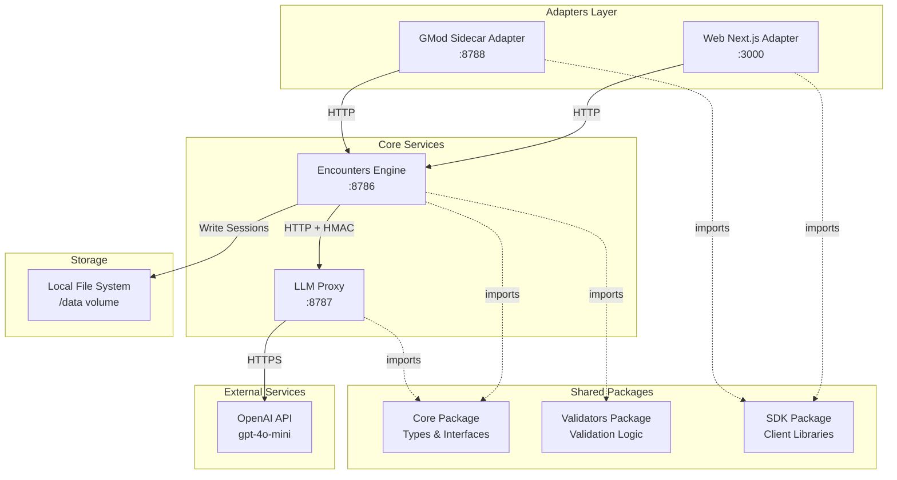

# AI Encounters Engine - Design Document

## Overview

The AI Encounters Engine is a modular, microservices-based system that generates and manages dynamic mission-style encounters for games and applications. The system leverages OpenAI's API to create contextual, AI-powered content and provides platform-specific adapters for integration with various game engines and web applications.

The architecture follows a monorepo pattern using pnpm workspaces, with Docker containerization for consistent deployment. The system is designed to be database-agnostic, using local file storage for session persistence, making it lightweight and easy to deploy.

## Architecture

### System Architecture



### Monorepo Structure


The project follows a pnpm workspace monorepo structure:

```
actuary/
├── packages/
│   ├── core/              # Shared types and interfaces
│   ├── validators/        # Validation logic
│   ├── sdk/              # Client libraries
│   └── llm-proxy/        # LLM proxy service (treated as package)
├── services/
│   └── engine/           # Core encounters engine service
├── adapters/
│   ├── web-next/         # Next.js web adapter
│   └── gmod-sidecar/     # GMod integration adapter
├── docker/
│   ├── Dockerfile.base   # Base image with shared dependencies
│   ├── Dockerfile.engine
│   ├── Dockerfile.llm-proxy
│   ├── Dockerfile.web
│   └── Dockerfile.gmod
├── docker-compose.yml
├── tsconfig.base.json    # Shared TypeScript config
├── package.json          # Root workspace config
└── pnpm-workspace.yaml
```

**Design Rationale**: The monorepo structure enables code sharing, consistent versioning, and simplified dependency management. Separating packages, services, and adapters provides clear boundaries and makes it easy to add new platform integrations.

## Components and Interfaces

### 1. Core Package (`packages/core`)

**Purpose**: Provides shared TypeScript types and interfaces used across all services and adapters.

**Key Types**:

```typescript
// Encounter structure
interface EncounterSpec {
  id: string;
  title: string;
  description: string;
  objectives: Objective[];
  npcs: NPC[];
  rewards: Reward[];
  difficulty: 'easy' | 'medium' | 'hard';
  estimatedDuration: number; // minutes
}

interface Objective {
  id: string;
  description: string;
  type: 'collect' | 'eliminate' | 'interact' | 'reach';
  target?: string;
  quantity?: number;
  completed: boolean;
}

interface NPC {
  id: string;
  name: string;
  role: string;
  dialogue: DialogueLine[];
}

interface DialogueLine {
  trigger: string;
  text: string;
}

interface Reward {
  type: 'currency' | 'item' | 'experience';
  amount: number;
  itemId?: string;
}

// Session management
interface Session {
  sessionId: string;
  playerId: string;
  encounter: EncounterSpec;
  state: SessionState;
  startedAt: string;
  completedAt?: string;
}

interface SessionState {
  currentObjectiveIndex: number;
  objectivesCompleted: string[];
  npcInteractions: Record<string, number>;
}

// Player context
interface PlayerContext {
  playerId: string;
  level?: number;
  preferences?: string[];
  history?: string[];
}
```

**Design Rationale**: Centralized type definitions ensure consistency across services and prevent type drift. The schema is designed to be flexible enough for various game types while maintaining structure.

### 2. Validators Package (`packages/validators`)

**Purpose**: Provides validation functions for API requests and data integrity.

**Key Functions**:

```typescript
// Validate encounter spec structure
function validateEncounterSpec(data: unknown): EncounterSpec | ValidationError;

// Validate session start request
function validateSessionStartRequest(data: unknown): { playerId: string } | ValidationError;

// Validate player context
function validatePlayerContext(data: unknown): PlayerContext | ValidationError;
```

**Design Rationale**: Separating validation logic into a dedicated package promotes reusability and makes it easier to maintain consistent validation rules across services.

### 3. SDK Package (`packages/sdk`)

**Purpose**: Provides client libraries for consuming the Encounters Engine API.

**Key Classes**:

```typescript
class EncountersClient {
  constructor(baseUrl: string, options?: ClientOptions);
  
  async startSession(playerId: string, context?: PlayerContext): Promise<Session>;
  async getSession(sessionId: string): Promise<Session>;
  async updateObjective(sessionId: string, objectiveId: string): Promise<Session>;
  async completeSession(sessionId: string): Promise<Session>;
}
```

**Design Rationale**: The SDK abstracts HTTP communication details and provides a clean, typed interface for adapters and external consumers.

### 4. LLM Proxy Service (`packages/llm-proxy`)

**Purpose**: Interfaces with OpenAI's API to generate encounter content and rewards.

**API Endpoints**:

- `POST /gen/encounter` - Generate a new encounter
- `POST /gen/reward` - Generate rewards for completed encounters
- `GET /health` - Health check endpoint

**Request Flow**:

1. Receives generation request with seed data (player context, difficulty, theme)
2. Constructs OpenAI API request with system prompt and structured output format
3. Validates HMAC signature for inter-service authentication
4. Sends request to OpenAI with `response_format: { type: "json_object" }`
5. Parses and validates response against EncounterSpec schema
6. Returns structured encounter data

**Configuration**:
- `AE_LLM_API_KEY` - OpenAI API key
- `AE_LLM_MODEL` - Model name (default: "gpt-4o-mini")
- `AE_LLM_TEMPERATURE` - Temperature setting (default: 0.2)
- `AE_LLM_MAX_OUTPUT_TOKENS` - Max tokens (default: 800)
- `AE_HMAC_SECRET` - HMAC secret for service authentication

**Design Rationale**: Isolating LLM communication in a separate service allows for:
- Independent scaling of AI generation workload
- Easy swapping of LLM providers without affecting core engine
- Centralized prompt engineering and response parsing
- Security through HMAC-based inter-service authentication

### 5. Encounters Engine Service (`services/engine`)

**Purpose**: Core service that manages encounter sessions, state tracking, and coordinates with LLM Proxy.

**API Endpoints**:

- `POST /session/start` - Start a new encounter session
- `GET /session/:id` - Get session details
- `PATCH /session/:id/objective/:objectiveId` - Update objective status
- `POST /session/:id/complete` - Complete a session
- `GET /health` - Health check endpoint

**Request Flow for Session Start**:

1. Receives `POST /session/start` with `playerId` and optional `PlayerContext`
2. Generates HMAC signature for LLM Proxy request
3. Calls LLM Proxy `POST /gen/encounter` with player context
4. Creates new session with generated encounter
5. Initializes session state
6. Returns complete session object to client

**Session Storage**:

Sessions are persisted to local filesystem in JSON format:
- Active sessions: stored in memory for fast access
- Completed sessions: written to `/data/sessions/{sessionId}.json`
- Storage is handled through a simple FileStorage class

**Design Rationale**: The engine acts as the orchestration layer, managing business logic while delegating AI generation to the LLM Proxy. File-based storage eliminates external dependencies and simplifies deployment.

### 6. Web Next.js Adapter (`adapters/web-next`)

**Purpose**: Provides a web-based interface for encounters using Next.js.

**Key Features**:
- Server-side rendering for encounter pages
- Real-time encounter state updates
- Integration with Encounters Engine via SDK
- Responsive UI for desktop and mobile

**Configuration**:
- `NEXT_PUBLIC_ENGINE_URL` - Encounters Engine URL (default: http://engine:8786)

**Design Rationale**: Next.js provides excellent developer experience, SSR capabilities, and easy deployment. The adapter pattern allows the web interface to evolve independently of the core engine.

### 7. GMod Sidecar Adapter (`adapters/gmod-sidecar`)

**Purpose**: Bridges Garry's Mod Lua scripts with the Encounters Engine.

**API Endpoints**:
- `POST /gmod/session/start` - Start session (GMod format)
- `GET /gmod/session/:id` - Get session (GMod format)
- `POST /gmod/session/:id/objective/:objectiveId` - Update objective (GMod format)

**Request Translation**:
- Converts GMod Lua HTTP requests to engine format
- Translates engine responses to GMod-friendly JSON
- Handles SteamID to playerId mapping

**Configuration**:
- `ENGINE_URL` - Encounters Engine URL (default: http://engine:8786)
- `GMOD_SIDECAR_PORT` - Port for GMod to connect (default: 8788)

**Design Rationale**: The sidecar pattern isolates GMod-specific logic and provides a stable API for Lua scripts, even as the core engine evolves.

## Data Models

### EncounterSpec Schema

The EncounterSpec is the core data structure generated by the LLM:

```json
{
  "id": "enc_abc123",
  "title": "The Missing Shipment",
  "description": "A valuable cargo has gone missing...",
  "objectives": [
    {
      "id": "obj_1",
      "description": "Locate the abandoned warehouse",
      "type": "reach",
      "target": "warehouse_location",
      "completed": false
    }
  ],
  "npcs": [
    {
      "id": "npc_1",
      "name": "Marcus the Merchant",
      "role": "quest_giver",
      "dialogue": [
        {
          "trigger": "initial",
          "text": "Thank goodness you're here!"
        }
      ]
    }
  ],
  "rewards": [
    {
      "type": "currency",
      "amount": 500
    }
  ],
  "difficulty": "medium",
  "estimatedDuration": 15
}
```

### Session State Model

Sessions track player progress through encounters:

```json
{
  "sessionId": "sess_xyz789",
  "playerId": "player_123",
  "encounter": { /* EncounterSpec */ },
  "state": {
    "currentObjectiveIndex": 0,
    "objectivesCompleted": [],
    "npcInteractions": {
      "npc_1": 2
    }
  },
  "startedAt": "2025-11-07T10:30:00Z",
  "completedAt": null
}
```

**Design Rationale**: The state model is intentionally simple to minimize storage requirements and make it easy to serialize/deserialize. Complex game state is managed by the game client, not the engine.

## Error Handling

### Error Response Format

All services return errors in a consistent format:

```typescript
interface ErrorResponse {
  error: {
    code: string;
    message: string;
    details?: Record<string, unknown>;
  };
  timestamp: string;
}
```

### Error Categories

1. **Validation Errors** (400)
   - Invalid request payload
   - Missing required fields
   - Type mismatches

2. **Authentication Errors** (401)
   - Invalid HMAC signature
   - Missing authentication headers

3. **Not Found Errors** (404)
   - Session not found
   - Player not found

4. **External Service Errors** (502)
   - OpenAI API failures
   - LLM Proxy unavailable

5. **Internal Errors** (500)
   - Unexpected exceptions
   - File system errors

### Retry Strategy

- LLM Proxy implements exponential backoff for OpenAI API calls
- Maximum 3 retry attempts with 1s, 2s, 4s delays
- Circuit breaker pattern for repeated failures

**Design Rationale**: Consistent error handling across services simplifies debugging and client error handling. Retry logic ensures resilience against transient failures.

## Security

### Inter-Service Authentication

Services use HMAC-SHA256 for authentication:

1. Sender creates signature: `HMAC-SHA256(request_body, HMAC_SECRET)`
2. Signature sent in `X-HMAC-Signature` header
3. Receiver validates signature before processing request

**Design Rationale**: HMAC provides lightweight authentication without requiring complex certificate management or token infrastructure.

### API Key Management

- OpenAI API key stored in environment variable `AE_LLM_API_KEY`
- Never logged or exposed in responses
- Validated on LLM Proxy startup

### Input Validation

- All external inputs validated using validators package
- SQL injection not applicable (no database)
- JSON parsing with size limits to prevent DoS

## Docker Deployment

### Base Image Strategy

`docker/Dockerfile.base` contains shared dependencies:
- Node.js runtime
- pnpm package manager
- Common system libraries

Service-specific Dockerfiles extend the base image and add service code.

**Design Rationale**: Shared base image reduces build times and ensures consistency across services.

### Docker Compose Configuration

```yaml
version: '3.8'

services:
  llm-proxy:
    build:
      context: .
      dockerfile: docker/Dockerfile.llm-proxy
    ports:
      - "8787:8787"
    environment:
      - AE_LLM_API_KEY=${AE_LLM_API_KEY}
      - AE_LLM_MODEL=${AE_LLM_MODEL:-gpt-4o-mini}
      - AE_HMAC_SECRET=${AE_HMAC_SECRET}
    networks:
      - encounters-net

  engine:
    build:
      context: .
      dockerfile: docker/Dockerfile.engine
    ports:
      - "8786:8786"
    environment:
      - AE_HMAC_SECRET=${AE_HMAC_SECRET}
      - LLM_PROXY_URL=http://llm-proxy:8787
    volumes:
      - ./data:/app/data
    depends_on:
      - llm-proxy
    networks:
      - encounters-net

  web-next:
    build:
      context: .
      dockerfile: docker/Dockerfile.web
    ports:
      - "3000:3000"
    environment:
      - NEXT_PUBLIC_ENGINE_URL=http://engine:8786
    depends_on:
      - engine
    networks:
      - encounters-net

  gmod-sidecar:
    build:
      context: .
      dockerfile: docker/Dockerfile.gmod
    ports:
      - "8788:8788"
    environment:
      - ENGINE_URL=http://engine:8786
    depends_on:
      - engine
    networks:
      - encounters-net

networks:
  encounters-net:
    driver: bridge

volumes:
  data:
```

**Design Rationale**: Docker Compose orchestrates all services with proper networking, making it trivial to start the entire system with a single command.

## Testing Strategy

### Unit Testing

- **Packages**: Test validation logic, type guards, SDK methods
- **Services**: Test business logic, state management, error handling
- **Tools**: Jest for test runner, ts-jest for TypeScript support

### Integration Testing

- **Service Communication**: Test engine ↔ LLM proxy communication
- **API Contracts**: Test request/response formats match specifications
- **Tools**: Supertest for HTTP testing

### End-to-End Testing

- **Full Flow**: Test session creation through completion
- **Adapter Integration**: Test web and GMod adapters with real engine
- **Tools**: Playwright for web adapter, custom scripts for GMod

### Mocking Strategy

- Mock OpenAI API responses in LLM Proxy tests
- Mock LLM Proxy in engine tests
- Use test fixtures for EncounterSpec data

**Design Rationale**: Layered testing approach ensures individual components work correctly while also validating system integration. Mocking external services (OpenAI) keeps tests fast and deterministic.

## Performance Considerations

### Caching Strategy

- Cache generated encounters for identical player contexts (1 hour TTL)
- In-memory session cache for active sessions
- LRU eviction policy when cache size exceeds limit

### Scalability

- LLM Proxy can be horizontally scaled (stateless)
- Engine can be scaled with shared file storage (NFS/EFS)
- Adapters are stateless and can scale independently

### Resource Limits

- OpenAI API rate limiting handled with queue and backoff
- Max concurrent sessions per engine instance: 1000
- Session file size limit: 1MB

**Design Rationale**: Caching reduces OpenAI API costs and improves response times. Stateless design enables horizontal scaling when needed.

## Development Workflow

### Local Development

1. Install dependencies: `pnpm i`
2. Build packages: `pnpm -r build`
3. Set environment variables in `.env`
4. Start services: `docker-compose up --build`

### Adding New Adapters

1. Create new directory in `adapters/`
2. Add package.json with workspace reference
3. Implement adapter using SDK package
4. Create Dockerfile in `docker/`
5. Add service to docker-compose.yml

### Adding New Encounter Types

1. Extend EncounterSpec type in core package
2. Update validators package with new validation rules
3. Update LLM Proxy system prompt to generate new fields
4. Rebuild and test

**Design Rationale**: Clear development workflow and extension points make it easy for new developers to contribute and for the system to evolve.


