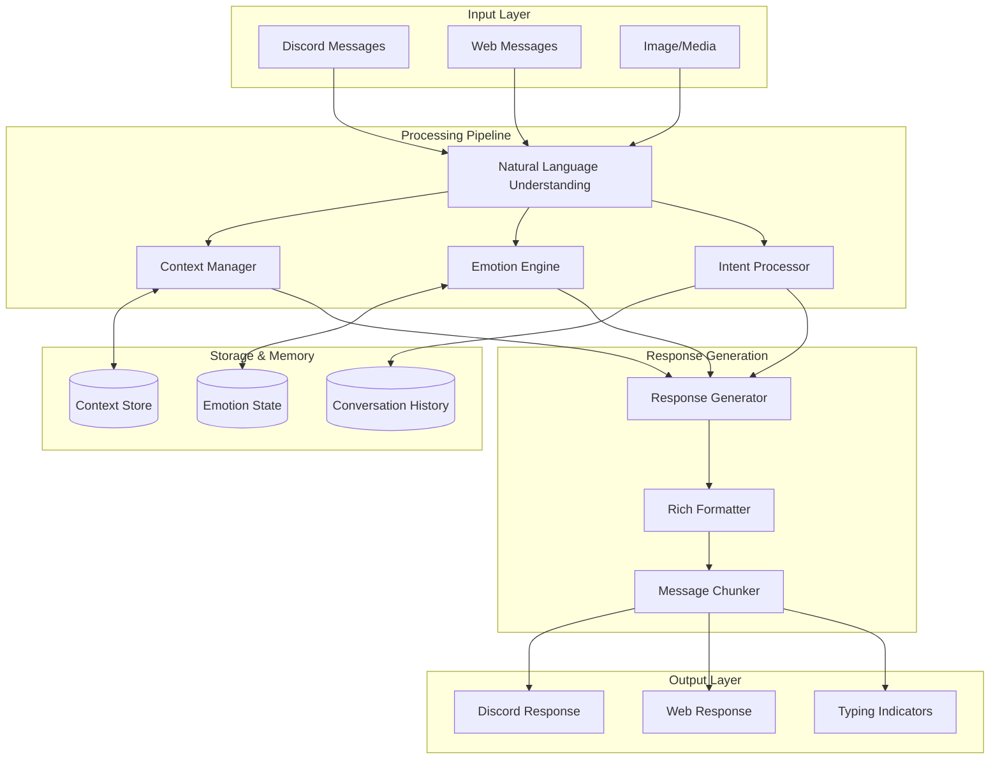

# Enhanced Texting Capabilities - Design Document

## Overview

This design outlines the architecture for enhancing BotBot's texting capabilities to create more natural, intelligent, and engaging conversational experiences. The system will transform the current basic intent parsing into a sophisticated natural language processing pipeline with context awareness, emotional intelligence, and multi-modal communication support.

The enhanced system will maintain backward compatibility with existing functionality while adding advanced features like conversation threading, rich formatting, proactive communication, and cross-platform synchronization.

## Architecture

### High-Level Architecture



### Core Components Integration

The enhanced texting system will integrate with existing BotBot components:

- **AgentRuntime**: Enhanced to support new conversation context and emotional state
- **Memory Manager**: Extended to handle conversation threading and context persistence
- **LLM Client**: Updated with new prompt templates for emotional and contextual responses
- **Safety Moderator**: Enhanced to handle rich content and emotional appropriateness

## Components and Interfaces

### 1. Natural Language Understanding Engine

**Location**: `packages/core/src/nlp/`

```typescript
interface NLUEngine {
  parseMessage(input: MessageInput): Promise<ParsedMessage>
  extractIntents(text: string, context: ConversationContext): Promise<Intent[]>
  resolveReferences(text: string, history: Message[]): Promise<ResolvedText>
  detectEmotionalTone(text: string): Promise<EmotionalTone>
}

interface ParsedMessage {
  intents: Intent[]
  emotionalTone: EmotionalTone
  references: Reference[]
  complexity: 'simple' | 'multi-part' | 'complex'
  mediaAttachments?: MediaAnalysis[]
}

interface Intent {
  type: string
  confidence: number
  parameters: Record<string, any>
  requiresContext: boolean
}
```

**Key Features**:
- Multi-intent parsing for complex messages
- Pronoun and reference resolution using conversation history
- Slang and informal language understanding
- Implied intent inference based on context

### 2. Conversation Context Manager

**Location**: `packages/core/src/conversation/`

```typescript
interface ConversationContextManager {
  getContext(userId: string, channelId: string): Promise<ConversationContext>
  updateContext(context: ConversationContext, message: Message): Promise<void>
  summarizeOldContext(context: ConversationContext): Promise<ContextSummary>
  separateUserContexts(channelId: string): Promise<Map<string, ConversationContext>>
}

interface ConversationContext {
  userId: string
  channelId: string
  platform: 'discord' | 'web'
  recentMessages: Message[]
  topicHistory: Topic[]
  activeReferences: Reference[]
  lastInteraction: Date
  contextSummary?: string
}

interface Topic {
  subject: string
  startedAt: Date
  lastMentioned: Date
  importance: number
  relatedMessages: string[]
}
```

**Key Features**:
- Per-user context separation in shared channels
- Automatic context summarization for long conversations
- Topic tracking and reference management
- Cross-platform context synchronization

### 3. Emotional Intelligence Engine

**Location**: `packages/core/src/emotion/`

```typescript
interface EmotionalEngine {
  analyzeUserEmotion(text: string, history: Message[]): Promise<UserEmotionalState>
  updateAgentMood(userEmotion: UserEmotionalState, currentMood: AgentMood): Promise<AgentMood>
  generateEmotionalResponse(mood: AgentMood, context: ConversationContext): Promise<EmotionalResponse>
  selectAppropriateEmojis(mood: AgentMood, responseType: string): string[]
}

interface UserEmotionalState {
  primary: 'happy' | 'sad' | 'angry' | 'excited' | 'frustrated' | 'neutral'
  intensity: number // 0-1
  confidence: number // 0-1
  indicators: string[] // words/phrases that led to this assessment
}

interface AgentMood {
  pleasure: number // -1 to 1 (PAD model)
  arousal: number // -1 to 1
  dominance: number // -1 to 1
  lastUpdated: Date
  triggers: string[] // what caused mood changes
}

interface EmotionalResponse {
  toneAdjustment: 'supportive' | 'energetic' | 'calm' | 'playful' | 'gentle'
  empathyLevel: number // 0-1
  suggestedEmojis: string[]
  responseStyle: 'formal' | 'casual' | 'enthusiastic' | 'caring'
}
```

**Key Features**:
- Real-time emotional tone detection
- PAD model-based mood system for agents
- Adaptive response tone based on user emotional state
- Contextual emoji selection

### 4. Rich Content Formatter

**Location**: `packages/core/src/formatting/`

```typescript
interface RichFormatter {
  formatResponse(content: string, platform: Platform, mood: AgentMood): Promise<FormattedContent>
  addEmojis(text: string, mood: AgentMood, emotionalTone: EmotionalTone): string
  structureContent(content: string, type: ContentType): FormattedContent
  analyzeMedia(attachment: MediaAttachment): Promise<MediaAnalysis>
}

interface FormattedContent {
  text: string
  embeds?: DiscordEmbed[]
  attachments?: Attachment[]
  formatting: {
    bold: TextRange[]
    italic: TextRange[]
    code: TextRange[]
    lists: ListItem[]
  }
}

interface MediaAnalysis {
  type: 'image' | 'video' | 'audio' | 'document'
  description: string
  relevantContext: string[]
  suggestedResponse: string
}
```

**Key Features**:
- Platform-specific formatting (Discord markdown, web HTML)
- Automatic emoji insertion based on mood and context
- Media analysis and contextual responses
- Structured content formatting (lists, code blocks, emphasis)

### 5. Message Chunking and Delivery System

**Location**: `packages/core/src/delivery/`

```typescript
interface MessageDeliverySystem {
  chunkMessage(content: string, platform: Platform): MessageChunk[]
  scheduleDelivery(chunks: MessageChunk[], options: DeliveryOptions): Promise<void>
  showTypingIndicator(channelId: string, duration: number): Promise<void>
  handleLongContent(content: string, fallbackOptions: FallbackOptions): Promise<DeliveryPlan>
}

interface MessageChunk {
  content: string
  order: number
  delay: number // ms to wait before sending
  requiresTyping: boolean
  type: 'text' | 'embed' | 'file'
}

interface DeliveryOptions {
  typingDelay: number
  chunkDelay: number
  maxChunkSize: number
  respectRateLimit: boolean
}

interface DeliveryPlan {
  chunks: MessageChunk[]
  fallbackAction?: 'dm' | 'summary' | 'file'
  estimatedDuration: number
}
```

**Key Features**:
- Intelligent message chunking at natural breakpoints
- Typing indicators with realistic timing
- Rate limit awareness and pacing
- Fallback strategies for oversized content

### 6. Proactive Communication Manager

**Location**: `packages/core/src/proactive/`

```typescript
interface ProactiveCommunicationManager {
  scheduleCheckIn(userId: string, lastInteraction: Date): Promise<void>
  identifyFollowUpOpportunities(conversations: Conversation[]): Promise<FollowUpOpportunity[]>
  generateProactiveMessage(opportunity: FollowUpOpportunity): Promise<string>
  respectUserPreferences(userId: string, messageType: ProactiveMessageType): Promise<boolean>
}

interface FollowUpOpportunity {
  userId: string
  type: 'check-in' | 'follow-up' | 'share-info' | 'special-occasion'
  context: string
  priority: number
  scheduledFor: Date
  relatedConversation?: string
}

interface ProactiveMessageType {
  category: 'social' | 'informational' | 'reminder' | 'celebration'
  frequency: 'rare' | 'occasional' | 'regular'
  userOptIn: boolean
}
```

**Key Features**:
- Smart check-in scheduling based on interaction patterns
- Context-aware follow-up identification
- User preference respect and opt-out mechanisms
- Special occasion recognition and acknowledgment

### 7. Cross-Platform Synchronization

**Location**: `packages/core/src/sync/`

```typescript
interface PlatformSyncManager {
  synchronizeConversation(conversationId: string): Promise<void>
  mergeConversationHistory(platforms: Platform[]): Promise<Message[]>
  syncAgentState(agentId: string, platforms: Platform[]): Promise<void>
  handlePlatformSwitch(userId: string, fromPlatform: Platform, toPlatform: Platform): Promise<void>
}

interface SyncedConversation {
  id: string
  participants: Participant[]
  messages: Message[]
  context: ConversationContext
  lastSyncedAt: Date
  platforms: Platform[]
}
```

**Key Features**:
- Real-time conversation synchronization
- Seamless platform switching
- Unified conversation history
- State consistency across platforms

## Data Models

### Enhanced Message Model

```typescript
interface EnhancedMessage extends Message {
  // Existing fields from current Message model
  emotionalTone: EmotionalTone
  intents: Intent[]
  references: Reference[]
  contextRelevance: number
  formattingMetadata: FormattingMetadata
  deliveryMetadata: DeliveryMetadata
}

interface FormattingMetadata {
  originalLength: number
  chunkCount: number
  emojisAdded: string[]
  formattingApplied: string[]
}

interface DeliveryMetadata {
  typingDuration: number
  deliveryDelay: number
  platform: Platform
  chunkOrder?: number
}
```

### Conversation Threading Model

```typescript
interface ConversationThread {
  id: string
  parentConversationId: string
  participants: string[]
  topic: string
  startedAt: Date
  lastActivity: Date
  messageCount: number
  contextSummary: string
  emotionalJourney: EmotionalSnapshot[]
}

interface EmotionalSnapshot {
  timestamp: Date
  userEmotions: Map<string, UserEmotionalState>
  agentMood: AgentMood
  conversationTone: string
}
```

### Enhanced Agent State

```typescript
interface EnhancedAgentInstance extends AgentInstance {
  // Existing fields from current AgentInstance model
  conversationContexts: Map<string, ConversationContext>
  emotionalMemory: EmotionalMemory[]
  proactiveSchedule: ProactiveTask[]
  platformStates: Map<Platform, PlatformState>
}

interface EmotionalMemory {
  userId: string
  emotionalPattern: UserEmotionalState[]
  preferredTone: string
  effectiveApproaches: string[]
  avoidancePatterns: string[]
  lastUpdated: Date
}

interface ProactiveTask {
  id: string
  type: ProactiveMessageType
  scheduledFor: Date
  context: string
  userId: string
  completed: boolean
}
```

## Error Handling

### Graceful Degradation Strategy

1. **NLU Failures**: Fall back to basic intent parsing if advanced NLU fails
2. **Context Loss**: Maintain conversation flow with reduced context awareness
3. **Emotional Engine Issues**: Default to neutral tone with basic emoji usage
4. **Formatting Failures**: Send plain text with minimal formatting
5. **Sync Failures**: Continue platform-specific operation with periodic retry

### Error Recovery Patterns

```typescript
interface ErrorRecoveryManager {
  handleNLUFailure(input: MessageInput, fallbackLevel: number): Promise<ParsedMessage>
  recoverContext(userId: string, channelId: string): Promise<ConversationContext>
  fallbackFormatting(content: string, platform: Platform): FormattedContent
  emergencyResponse(error: Error, context: ConversationContext): Promise<string>
}
```

### Monitoring and Alerting

- Track NLU accuracy and confidence scores
- Monitor context retrieval performance
- Alert on emotional engine anomalies
- Log formatting and delivery failures
- Track cross-platform sync success rates

## Testing Strategy

### Unit Testing

1. **NLU Engine Tests**
   - Intent parsing accuracy
   - Reference resolution correctness
   - Emotional tone detection precision
   - Multi-intent handling

2. **Context Manager Tests**
   - Context persistence and retrieval
   - User separation in shared channels
   - Context summarization quality
   - Memory management efficiency

3. **Emotional Engine Tests**
   - Mood calculation accuracy
   - Tone adaptation appropriateness
   - Emoji selection relevance
   - Emotional memory formation

4. **Formatting Tests**
   - Platform-specific formatting correctness
   - Media analysis accuracy
   - Content structuring effectiveness
   - Emoji integration naturalness

### Integration Testing

1. **End-to-End Conversation Flows**
   - Multi-turn conversations with context
   - Emotional state transitions
   - Cross-platform conversation continuity
   - Proactive message triggering

2. **Performance Testing**
   - Response time under load
   - Context retrieval speed
   - Memory usage optimization
   - Concurrent conversation handling

3. **Platform Integration Testing**
   - Discord-specific features
   - Web interface compatibility
   - Media handling across platforms
   - Sync reliability testing

### User Acceptance Testing

1. **Conversation Quality Assessment**
   - Naturalness of interactions
   - Context awareness effectiveness
   - Emotional appropriateness
   - User satisfaction metrics

2. **Feature Usability Testing**
   - Rich formatting appreciation
   - Proactive communication reception
   - Cross-platform experience smoothness
   - Error recovery user experience

## Design Decisions and Rationales

### 1. Modular NLU Pipeline
**Decision**: Separate NLU components for intent parsing, reference resolution, and emotional analysis.
**Rationale**: Allows independent optimization and testing of each component, enables graceful degradation, and supports future enhancements.

### 2. Per-User Context Isolation
**Decision**: Maintain separate conversation contexts for each user even in shared channels.
**Rationale**: Prevents context bleeding between users, enables personalized responses, and maintains privacy boundaries.

### 3. PAD Model for Emotional State
**Decision**: Use Pleasure-Arousal-Dominance model for agent mood representation.
**Rationale**: Provides nuanced emotional representation, enables smooth mood transitions, and aligns with psychological research.

### 4. Chunking at Natural Breakpoints
**Decision**: Implement intelligent message chunking based on content structure rather than character limits.
**Rationale**: Maintains message coherence, improves readability, and creates more natural conversation flow.

### 5. Opt-in Proactive Communication
**Decision**: Make proactive features user-configurable with default opt-out.
**Rationale**: Respects user preferences, prevents spam perception, and allows gradual feature adoption.

### 6. Cross-Platform State Synchronization
**Decision**: Implement real-time state sync across Discord and web platforms.
**Rationale**: Provides seamless user experience, maintains conversation continuity, and enables platform flexibility.

### 7. Fallback Strategy Hierarchy
**Decision**: Implement multiple levels of graceful degradation for each component.
**Rationale**: Ensures system reliability, maintains user experience during failures, and provides debugging insights.

This design provides a comprehensive foundation for implementing enhanced texting capabilities while maintaining system reliability and user experience quality. The modular architecture allows for incremental implementation and testing of individual components.