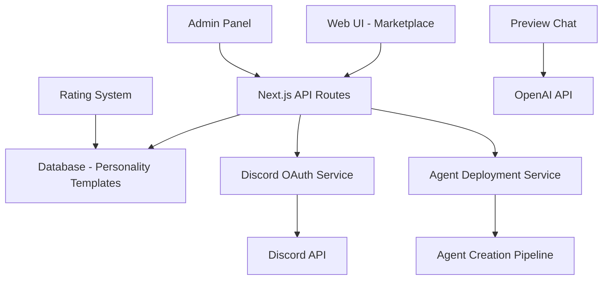

# Design Document

## Overview

The Personality Marketplace is a web-based interface that extends the existing BotBot system to provide a curated collection of pre-built AI personalities. Users can browse, preview, and deploy these personalities to their Discord servers through a streamlined interface that integrates with Discord's OAuth system.

The marketplace will be implemented as a new section within the existing Next.js web application, leveraging the current database schema and adding new models for personality templates and marketplace metadata.

## Architecture

### High-Level Architecture



### Component Architecture

The marketplace will consist of several key components:

1. **Marketplace Browser** - Grid view of available personalities
2. **Personality Preview Modal** - Detailed view with live chat demo
3. **Deployment Flow** - Discord OAuth and server selection
4. **Admin Management Panel** - CRUD operations for personality templates
5. **Rating and Review System** - User feedback collection

## Components and Interfaces

### Database Schema Extensions

```typescript
// New models to add to Prisma schema
model PersonalityTemplate {
  id          String   @id @default(cuid())
  name        String
  description String   @db.Text
  persona     String   @db.Text
  systemPrompt String  @map("system_prompt") @db.Text
  traits      Json     @default("{}")
  avatar      String?  // URL to personality avatar
  category    String   // e.g., "Gaming", "Education", "Entertainment"
  tags        String[] // Searchable tags
  isPublic    Boolean  @default(true)
  createdBy   String   @map("created_by") // Admin user ID
  deployCount Int      @default(0) @map("deploy_count")
  avgRating   Float?   @map("avg_rating")
  createdAt   DateTime @default(now()) @map("created_at")
  updatedAt   DateTime @updatedAt @map("updated_at")

  // Relations
  ratings     PersonalityRating[]
  deployments PersonalityDeployment[]

  @@map("personality_templates")
}

model PersonalityRating {
  id           String   @id @default(cuid())
  templateId   String   @map("template_id")
  userId       String   @map("user_id")
  rating       Int      // 1-5 stars
  review       String?  @db.Text
  createdAt    DateTime @default(now()) @map("created_at")

  // Relations
  template PersonalityTemplate @relation(fields: [templateId], references: [id], onDelete: Cascade)
  user     User                @relation(fields: [userId], references: [id], onDelete: Cascade)

  @@unique([templateId, userId])
  @@map("personality_ratings")
}

model PersonalityDeployment {
  id              String   @id @default(cuid())
  templateId      String   @map("template_id")
  userId          String   @map("user_id")
  agentId         String   @map("agent_id")
  discordGuildId  String   @map("discord_guild_id")
  deployedAt      DateTime @default(now()) @map("deployed_at")

  // Relations
  template PersonalityTemplate @relation(fields: [templateId], references: [id])
  user     User                @relation(fields: [userId], references: [id])
  agent    Agent              @relation(fields: [agentId], references: [id])

  @@map("personality_deployments")
}
```

### API Endpoints

```typescript
// API route structure
/api/marketplace/
├── personalities/
│   ├── GET /           # List personalities with filters
│   ├── GET /[id]       # Get personality details
│   ├── POST /[id]/rate # Rate a personality
│   └── POST /[id]/deploy # Deploy to Discord server
├── categories/
│   └── GET /           # Get available categories
├── preview/
│   └── POST /[id]/chat # Preview chat with personality
└── admin/
    ├── GET /personalities    # Admin: List all personalities
    ├── POST /personalities   # Admin: Create personality
    ├── PUT /personalities/[id] # Admin: Update personality
    └── DELETE /personalities/[id] # Admin: Delete personality
```

### React Components

```typescript
// Component hierarchy
MarketplacePage
├── MarketplaceHeader
├── SearchAndFilters
│   ├── SearchBar
│   ├── CategoryFilter
│   └── SortOptions
├── PersonalityGrid
│   └── PersonalityCard[]
├── PersonalityPreviewModal
│   ├── PersonalityDetails
│   ├── PreviewChat
│   └── DeploymentButton
└── DeploymentFlow
    ├── DiscordOAuthButton
    ├── ServerSelector
    └── DeploymentConfirmation
```

## Data Models

### PersonalityTemplate Interface

```typescript
interface PersonalityTemplate {
  id: string;
  name: string;
  description: string;
  persona: string;
  systemPrompt: string;
  traits: Record<string, any>;
  avatar?: string;
  category: string;
  tags: string[];
  isPublic: boolean;
  createdBy: string;
  deployCount: number;
  avgRating?: number;
  createdAt: Date;
  updatedAt: Date;
  
  // Computed fields
  ratings?: PersonalityRating[];
  sampleMessages?: string[];
}
```

### Marketplace Filters

```typescript
interface MarketplaceFilters {
  search?: string;
  category?: string;
  tags?: string[];
  minRating?: number;
  sortBy: 'popular' | 'newest' | 'rating' | 'name';
  page: number;
  limit: number;
}
```

### Deployment Request

```typescript
interface DeploymentRequest {
  templateId: string;
  discordGuildId: string;
  customizations?: {
    name?: string;
    traits?: Record<string, any>;
  };
}
```

## Error Handling

### Client-Side Error Handling

- **Network Errors**: Display retry buttons and offline indicators
- **Authentication Errors**: Redirect to Discord OAuth flow
- **Permission Errors**: Show clear messages about required Discord permissions
- **Validation Errors**: Inline form validation with helpful messages

### Server-Side Error Handling

- **Database Errors**: Log errors and return generic error messages to clients
- **Discord API Errors**: Handle rate limits and permission issues gracefully
- **OpenAI API Errors**: Fallback to cached sample responses for previews
- **Deployment Failures**: Rollback partial deployments and notify users

### Error Response Format

```typescript
interface ApiError {
  error: string;
  message: string;
  code?: string;
  details?: Record<string, any>;
}
```

## Testing Strategy

### Unit Tests

- **Component Tests**: React Testing Library for all UI components
- **API Route Tests**: Jest tests for all API endpoints
- **Database Tests**: Prisma client mocking and integration tests
- **Utility Tests**: Pure function testing for filters, validation, etc.

### Integration Tests

- **End-to-End Flow**: Cypress tests for complete deployment workflow
- **Discord OAuth**: Mock Discord API responses for testing
- **Database Integration**: Test with real database in CI environment
- **Preview Chat**: Mock OpenAI API for consistent testing

### Test Data

```typescript
// Sample test personalities
const testPersonalities = [
  {
    name: "Atlas the Scientist",
    category: "Education",
    tags: ["science", "curious", "helpful"],
    persona: "A curious scientist who loves explaining complex topics...",
    // ... other fields
  },
  {
    name: "Luna the Gamer",
    category: "Gaming", 
    tags: ["gaming", "competitive", "friendly"],
    persona: "An enthusiastic gamer who knows all the latest games...",
    // ... other fields
  }
];
```

### Performance Testing

- **Load Testing**: Simulate high traffic on marketplace endpoints
- **Database Performance**: Test query performance with large datasets
- **Preview Chat**: Test concurrent chat sessions
- **Deployment Scaling**: Test multiple simultaneous deployments

## Security Considerations

### Authentication & Authorization

- **Discord OAuth**: Secure token handling and refresh logic
- **Admin Access**: Role-based access control for personality management
- **Rate Limiting**: Prevent abuse of preview chat and deployment endpoints
- **CSRF Protection**: Secure form submissions and API calls

### Data Validation

- **Input Sanitization**: Validate all user inputs and personality content
- **Content Moderation**: Screen personality descriptions and sample messages
- **SQL Injection Prevention**: Use Prisma's parameterized queries
- **XSS Prevention**: Sanitize user-generated content in reviews

### Privacy & Data Protection

- **User Data**: Minimal data collection, clear privacy policy
- **Discord Permissions**: Request only necessary bot permissions
- **Data Retention**: Clear policies for user data and deployment history
- **Audit Logging**: Track admin actions and deployments

## Performance Optimization

### Frontend Optimization

- **Code Splitting**: Lazy load marketplace components
- **Image Optimization**: Next.js Image component for personality avatars
- **Caching**: Cache personality data and user preferences
- **Virtual Scrolling**: Handle large personality lists efficiently

### Backend Optimization

- **Database Indexing**: Optimize queries for search and filtering
- **API Caching**: Cache personality templates and category data
- **Connection Pooling**: Efficient database connection management
- **CDN Integration**: Serve static assets from CDN

### Monitoring & Analytics

- **Performance Metrics**: Track page load times and API response times
- **User Analytics**: Monitor marketplace usage patterns
- **Error Tracking**: Comprehensive error logging and alerting
- **Deployment Success Rates**: Track deployment completion rates