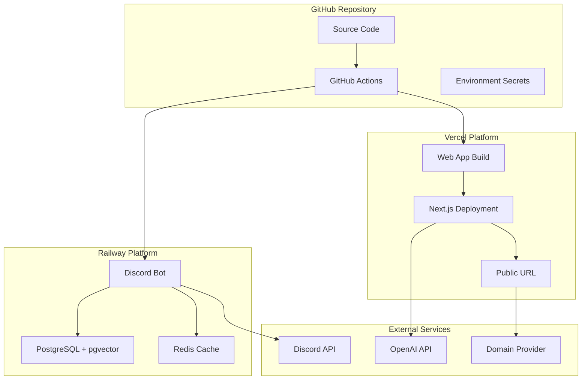

# BotBot GitHub Deployment Design

## Overview

This design document outlines the architecture and implementation strategy for deploying the BotBot project to GitHub and setting up production hosting. The solution focuses on GitHub-native deployment using Vercel for the web application and Railway for the Discord bot and database services.

## Architecture

### Deployment Architecture



### Service Distribution

| Service | Platform | Reason |
|---------|----------|---------|
| Next.js Web App | Vercel | Native Next.js support, automatic deployments, edge functions |
| Discord Bot | Railway | Persistent processes, database integration, simple deployment |
| PostgreSQL | Railway | pgvector support, managed backups, connection pooling |
| Redis | Railway | Integrated with bot deployment, persistence, monitoring |

## Components and Interfaces

### GitHub Repository Structure

```
botbot/
├── .github/
│   ├── workflows/
│   │   ├── ci.yml              # Continuous Integration
│   │   ├── deploy-web.yml      # Vercel deployment
│   │   └── deploy-bot.yml      # Railway deployment
│   └── ISSUE_TEMPLATE/         # Issue templates
├── docs/
│   ├── DEPLOYMENT.md           # Deployment guide
│   ├── SETUP.md               # Local setup guide
│   └── TROUBLESHOOTING.md     # Common issues
├── .env.example               # Environment template
├── .gitignore                 # Git ignore rules
├── LICENSE                    # Open source license
├── README.md                  # Project overview
├── railway.json               # Railway configuration
└── vercel.json               # Vercel configuration
```

### GitHub Actions Workflows

#### CI Pipeline (`ci.yml`)
- **Triggers**: Push to any branch, pull requests
- **Jobs**:
  - Install dependencies
  - Run TypeScript compilation
  - Execute tests with coverage
  - Lint code with ESLint
  - Check formatting with Prettier
  - Security audit with npm audit

#### Web Deployment (`deploy-web.yml`)
- **Triggers**: Push to main branch
- **Jobs**:
  - Build Next.js application
  - Deploy to Vercel via GitHub integration
  - Update deployment status
  - Notify on success/failure

#### Bot Deployment (`deploy-bot.yml`)
- **Triggers**: Push to main branch, manual dispatch
- **Jobs**:
  - Build Discord bot
  - Deploy to Railway via CLI
  - Run database migrations
  - Health check bot connection
  - Rollback on failure

### Environment Configuration

#### GitHub Secrets
```
# Discord Configuration
DISCORD_TOKEN
DISCORD_CLIENT_ID
DISCORD_CLIENT_SECRET
DISCORD_PUBLIC_KEY

# OpenAI Configuration
OPENAI_API_KEY

# Database URLs (Railway auto-generated)
DATABASE_URL
DIRECT_URL

# Redis URL (Railway auto-generated)
REDIS_URL

# Next.js Configuration
NEXT_PUBLIC_APP_URL
NEXTAUTH_SECRET
NEXTAUTH_URL

# Railway API Token (for deployments)
RAILWAY_TOKEN
```

#### Platform-Specific Variables

**Vercel Environment Variables:**
- `NEXT_PUBLIC_APP_URL`: Public application URL
- `NEXTAUTH_SECRET`: NextAuth.js secret
- `NEXTAUTH_URL`: Authentication callback URL
- `DATABASE_URL`: Database connection string
- `REDIS_URL`: Redis connection string
- `OPENAI_API_KEY`: OpenAI API access

**Railway Environment Variables:**
- `DISCORD_TOKEN`: Bot authentication token
- `DISCORD_CLIENT_ID`: Discord application ID
- `DISCORD_CLIENT_SECRET`: OAuth client secret
- `DISCORD_PUBLIC_KEY`: Discord public key
- `DATABASE_URL`: PostgreSQL connection (auto-generated)
- `REDIS_URL`: Redis connection (auto-generated)
- `OPENAI_API_KEY`: OpenAI API access

## Data Models

### Deployment Configuration Files

#### `railway.json`
```json
{
  "$schema": "https://railway.app/railway.schema.json",
  "build": {
    "builder": "NIXPACKS"
  },
  "deploy": {
    "startCommand": "npm run start --filter=@botbot/bot",
    "healthcheckPath": "/health",
    "healthcheckTimeout": 100,
    "restartPolicyType": "ON_FAILURE",
    "restartPolicyMaxRetries": 10
  }
}
```

#### `vercel.json`
```json
{
  "buildCommand": "npm run build --filter=@botbot/web",
  "outputDirectory": "apps/web/.next",
  "installCommand": "npm install",
  "framework": "nextjs",
  "regions": ["iad1"],
  "functions": {
    "apps/web/app/api/**/*.ts": {
      "maxDuration": 30
    }
  }
}
```

### Database Migration Strategy

#### Prisma Configuration
- **Development**: Use `prisma db push` for rapid iteration
- **Production**: Use `prisma migrate deploy` for versioned migrations
- **Railway Integration**: Automatic migration on deployment via build script

#### Migration Workflow
1. Developer creates migration locally: `npx prisma migrate dev`
2. Migration files committed to repository
3. Railway deployment runs: `npx prisma migrate deploy`
4. Database schema updated automatically

## Error Handling

### Deployment Failure Recovery

#### Web Application (Vercel)
- **Build Failures**: Automatic rollback to previous deployment
- **Runtime Errors**: Error boundaries with fallback UI
- **API Failures**: Graceful degradation with offline mode
- **Monitoring**: Vercel Analytics and error tracking

#### Discord Bot (Railway)
- **Connection Failures**: Automatic restart with exponential backoff
- **Database Errors**: Connection pooling and retry logic
- **Memory Issues**: Process monitoring and automatic scaling
- **Health Checks**: HTTP endpoint for Railway health monitoring

### Error Notification System
- **GitHub Actions**: Workflow failure notifications via email/Slack
- **Vercel**: Deployment status updates in GitHub commits
- **Railway**: Service alerts via dashboard and webhooks
- **Discord**: Bot status monitoring with admin notifications

## Testing Strategy

### Pre-Deployment Testing

#### Local Testing
```bash
# Install dependencies
npm install

# Run all tests
npm run test

# Build applications
npm run build

# Start services locally
npm run dev
```

#### Staging Environment
- **Vercel Preview**: Automatic preview deployments for pull requests
- **Railway Staging**: Separate staging service for bot testing
- **Database**: Staging database with production-like data
- **Integration Tests**: End-to-end testing in staging environment

### Production Monitoring

#### Health Checks
- **Web App**: `/api/health` endpoint with database connectivity check
- **Discord Bot**: `/health` endpoint with Discord API status
- **Database**: Connection pool monitoring and query performance
- **Redis**: Memory usage and connection status

#### Performance Metrics
- **Response Times**: API endpoint latency monitoring
- **Error Rates**: 4xx/5xx error tracking and alerting
- **Resource Usage**: Memory, CPU, and database connection monitoring
- **User Metrics**: Page load times and user engagement tracking

## Security Considerations

### Secret Management
- **GitHub Secrets**: Encrypted storage for sensitive configuration
- **Vercel Environment**: Secure variable storage with team access controls
- **Railway Variables**: Encrypted environment variables with service isolation
- **API Keys**: Regular rotation schedule and access monitoring

### Access Control
- **Repository**: Branch protection rules and required reviews
- **Deployment**: Restricted deployment permissions and approval workflows
- **Database**: Connection encryption and access logging
- **Services**: Network isolation and firewall rules

### Security Monitoring
- **Dependency Scanning**: Automated vulnerability detection in CI
- **Code Analysis**: Static security analysis with CodeQL
- **Runtime Protection**: Rate limiting and DDoS protection
- **Audit Logging**: Comprehensive logging of all deployment activities

## Deployment Workflow

### Development to Production Pipeline

1. **Feature Development**
   - Create feature branch from main
   - Implement changes with tests
   - Run local testing and validation

2. **Pull Request Process**
   - Create PR with description and testing notes
   - Automated CI checks (tests, linting, security)
   - Code review and approval required
   - Vercel preview deployment for testing

3. **Merge to Main**
   - Automatic deployment to production
   - Vercel deploys web application
   - Railway deploys Discord bot
   - Database migrations run automatically

4. **Post-Deployment**
   - Health checks verify service status
   - Monitoring alerts on any issues
   - Rollback procedures if needed

### Manual Deployment Options

#### Emergency Deployments
- Manual trigger via GitHub Actions
- Direct Railway CLI deployment
- Vercel CLI deployment with custom build

#### Rollback Procedures
- Vercel: Instant rollback via dashboard
- Railway: Redeploy previous version
- Database: Migration rollback if needed

This design provides a comprehensive, GitHub-native deployment strategy that leverages modern platforms while maintaining simplicity and reliability.